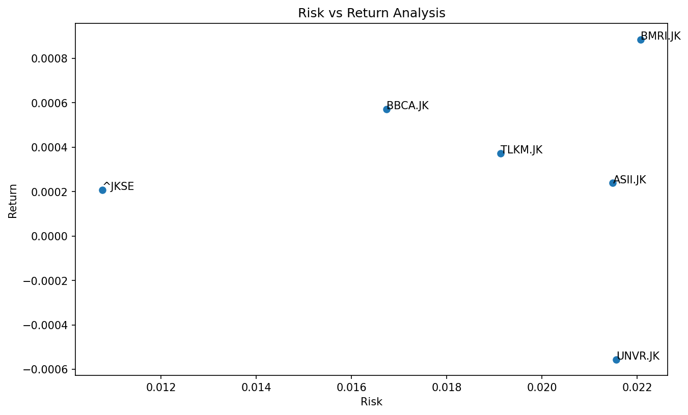

# 📈 Stock Portfolio Analysis — IDX Blue Chip Stocks (2020–2023)


> A quantitative analysis of 5 IDX blue chip stocks against the IHSG benchmark — measuring risk, return, and portfolio efficiency using financial metrics including Sharpe Ratio and Volatility.

---

## 📌 Project Overview

This project analyzes the performance of **5 Indonesian blue chip stocks** from 2020 to 2023 using Python and financial data from Yahoo Finance. The goal is to identify which stocks delivered the best **risk-adjusted returns** and provide data-driven investment recommendations.

**Stocks Analyzed:**
| Ticker | Company |
|--------|---------|
| BBCA.JK | Bank Central Asia |
| BMRI.JK | Bank Mandiri |
| TLKM.JK | Telkom Indonesia |
| ASII.JK | Astra International |
| UNVR.JK | Unilever Indonesia |
| ^JKSE | IHSG (Benchmark) |

---

## 🎯 Problem Statement

As an investor, which IDX blue chip stocks delivered the best **risk-adjusted returns** from 2020–2023? Which stocks outperformed the IHSG benchmark, and which ones should be avoided?

---

## 💡 Key Insights

- 📈 **BMRI delivered the highest cumulative return** from 2020–2023, significantly outperforming the IHSG benchmark
- 🏦 **BBCA showed the lowest volatility** — most stable stock with consistent returns, ideal for risk-averse investors
- 🏆 **BBCA, BMRI, and TLKM all outperformed IHSG** — these are alpha-generating stocks
- ⚠️ **UNVR showed negative cumulative return** — investors who held Unilever from 2020 ended up with losses by 2023
- 📉 **COVID-19 crash (Q1–Q2 2020)** caused a market-wide decline across all stocks simultaneously
- 📊 **BMRI has the best Sharpe Ratio** — highest return per unit of risk taken
- ❌ **ASII and UNVR underperformed IHSG** — not recommended compared to index investing

---

## 🛠️ Tools & Technologies

| Tool | Purpose |
|------|---------|
| Python | Core programming language |
| yfinance | Fetch historical stock data from Yahoo Finance |
| Pandas | Data manipulation & analysis |
| NumPy | Mathematical calculations |
| Matplotlib | Data visualization |
| Jupyter Notebook | Development environment |

---

## ⚙️ Methodology

### 1. Data Collection
- Downloaded 4 years of daily price data (2020–2023) using `yfinance`
- Extracted closing prices for all 6 tickers

### 2. Return Analysis
- Calculated **Daily Return** using `.pct_change()`
- Calculated **Cumulative Return** using `(1 + daily_returns).cumprod() - 1`

### 3. Risk Analysis
- Calculated **Volatility** (Standard Deviation of daily returns)
- Higher volatility = higher risk

### 4. Risk-Adjusted Return
- Calculated **Sharpe Ratio** using risk-free rate of 6% per annum (Indonesian SBI rate)
- Formula: `(avg_return - risk_free_rate) / volatility`

### 5. Visualization
- Cumulative return line chart (all stocks vs IHSG)
- Risk vs Return scatter plot with stock labels

---

## 📊 Visualizations

### Cumulative Return 2020–2023


### Risk vs Return Analysis


---

## 📋 Results Summary

| Stock | Cumulative Return | Volatility | Sharpe Ratio | Verdict |
|-------|------------------|------------|--------------|---------|
| BMRI | ⬆️ Highest | ⬆️ Highest | ✅ Best | Aggressive Buy |
| BBCA | ⬆️ High | ⬇️ Lowest | ✅ Good | Defensive Buy |
| TLKM | 🟡 Moderate | 🟡 Moderate | 🟡 Fair | Hold |
| ASII | ⬇️ Low | 🟡 Moderate | ❌ Poor | Avoid |
| UNVR | ⬇️ Negative | 🟡 Moderate | ❌ Negative | Avoid |

---

## 💡 Investment Recommendations

Based on the quantitative analysis:

1. **Aggressive investors** → **BMRI** offers the highest return and best Sharpe Ratio, though with higher volatility
2. **Conservative investors** → **BBCA** is the most stable blue chip with consistent above-benchmark returns
3. **Avoid UNVR and ASII** → Both underperformed IHSG; better to invest in an index fund instead
4. **Diversification** → Combining BBCA (low risk) + BMRI (high return) creates a balanced portfolio

> ⚠️ *This analysis is for educational purposes only and does not constitute financial advice.*

---

## 📁 Repository Structure

```
stock-portfolio-analysis/
│
├── data/
│   └── (data fetched directly via yfinance API)
│
├── images/
│   ├── cumulative_return.png
│   └── risk_vs_return.png
│
├── notebook/
│   └── stock_portfolio_analysis.ipynb
│
└── README.md
```

---

## 📂 Dataset

- **Source:** Yahoo Finance via `yfinance` library
- **Period:** January 2020 — December 2023
- **Frequency:** Daily closing prices
- **Stocks:** 5 IDX blue chip stocks + IHSG benchmark

---

## 👤 Author

**Apriandi Manurung**
- 📧 Email: apriandimanurung@email.com
- 💼 LinkedIn: [linkedin.com/in/apriandimanurung](https://linkedin.com/in/apriandimanurung)
- 🌐 Portfolio: [Notion Portfolio](#)

---

*If you found this project helpful, feel free to ⭐ star this repository!*
